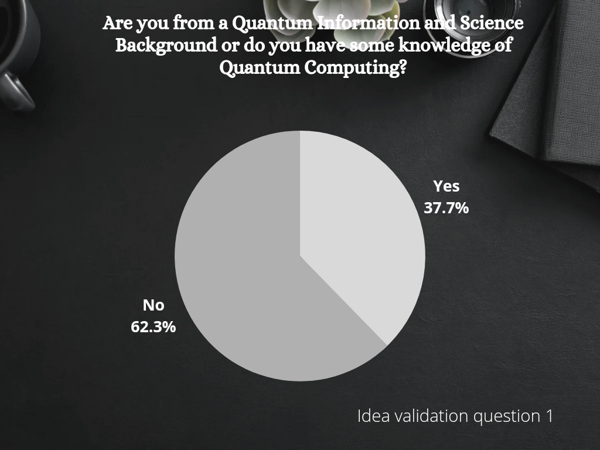
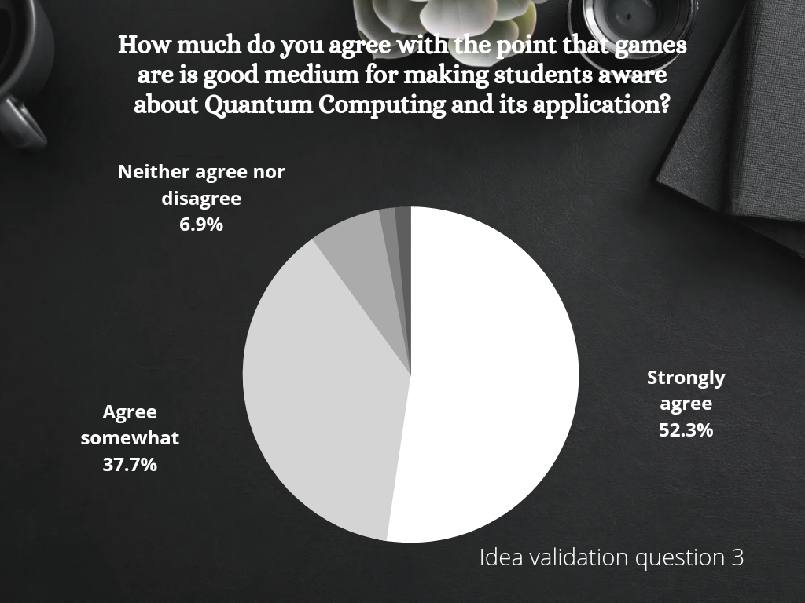
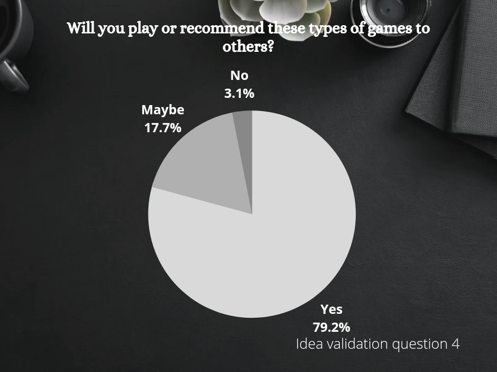
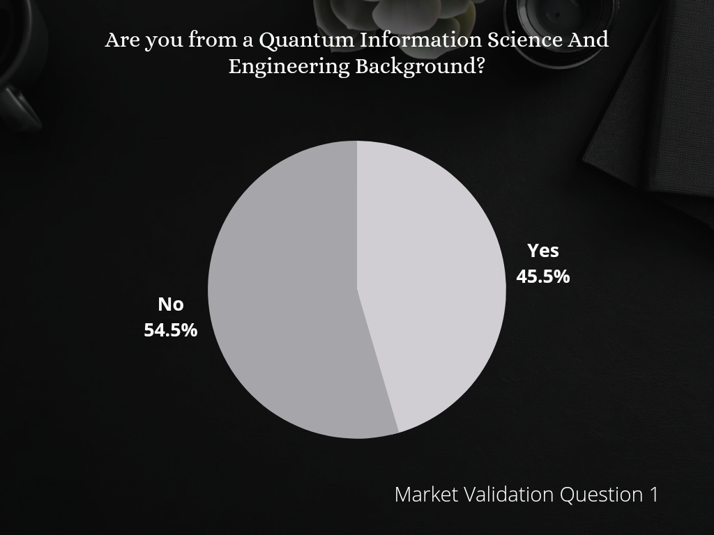
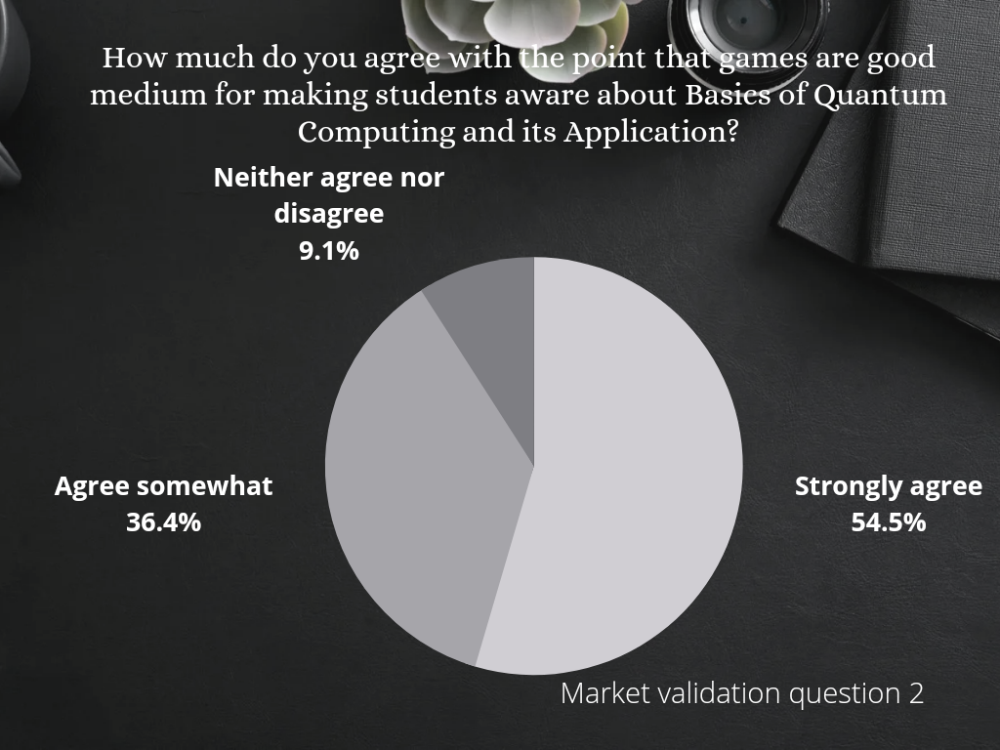
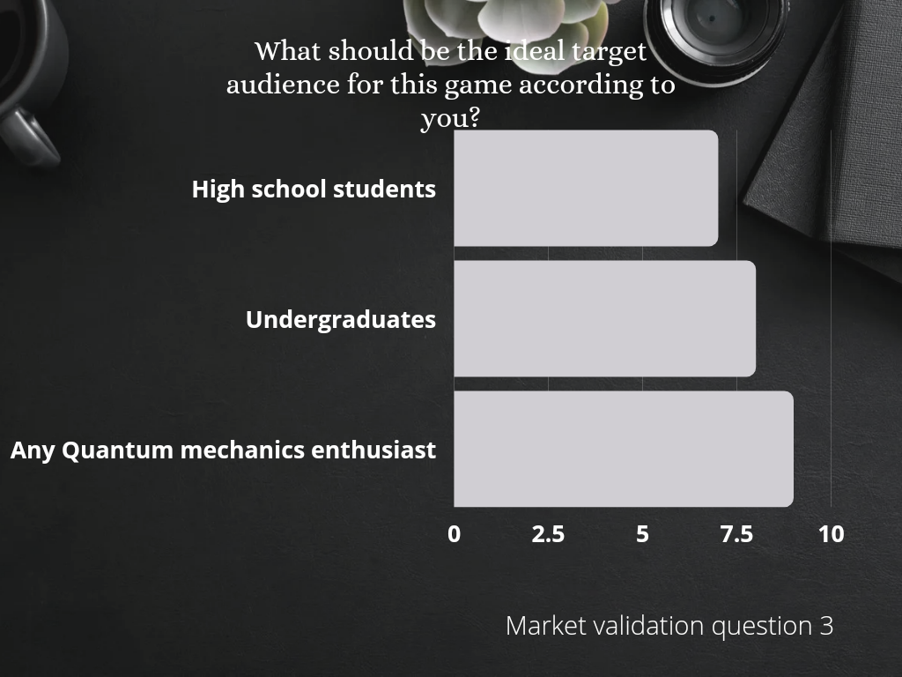
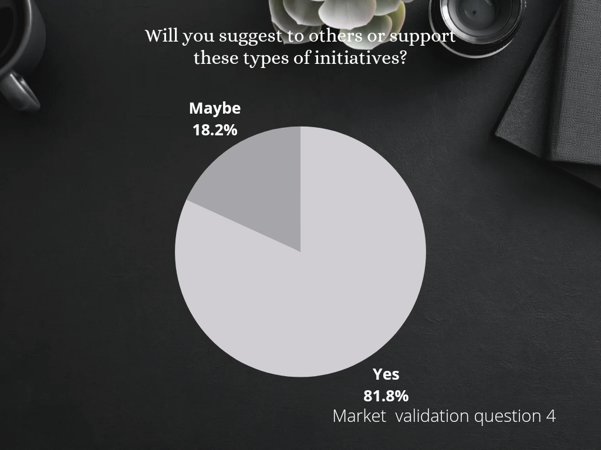

# Siya's Quantum Oddessy

## Introduction
Quantum Computers have the potential to revolutionize computation by making certain problems solvable. While no quantum computer is yet sophisticated enough to carry out calculations that a classical computer can't, great progress is underway. The race for building less noisy quantum computers with more qubits is already begun. It's now quite important to attract teens to this field. We intend to blend the basics of Quantum Computing with a simple side-scroller game and AI Voice Assistance.

### **About the project**
In this project, we aim to develop a side-scroller game with AI Voice Aistance using Alan AI. The major purpose of the game is to develop intrest of school and undergraduate students, or anyone who want to explore quantum computing. This project is build after idea validation step with response of 130 college students and market validation from the people working in the field of quantum computing and game development.
 
 In a night full of star showers, Sia is out on an adventure to explore the beguiling world of Quantum Computers. But, an evil demon Raka, with his Super-Quantum Gun wants to rule the planet by not letting anyone in this world know about powerful Quantum Technology. Raka is trying to kill Siya with qubit balls shot by his powerful quantum gun. She has to defeat the enemy's qubit balls with her gun. But her gun is not so advanced.  Help Siya in her journey to upgrade her weapons and defeat the demon. 

Initially, a red box represents our character Siya. We will add sprite for her in future. 
The game integrates the concept of Quantum Mechanics and Quantum Computing in a relaxing manner. Initially, we have built the prototype of the game with only one level explaining qubit and quantum Circuit. The player can change the qubit state by first writing qiskit code in the constructing box and then using Key Q for a qubit in state |0> and X for a qubit in state |1>.  We have planned to make some levels before this level for making players understand classical bits, superposition, interference, and entanglement before coming to this level. More interesting levels after this level will be for telling users how different gates work on the qubit. This game is only a small prototype of what we are thinking to build.
 
 
### 🚀 Languages and Tools Used:

  
     
     
      
     
     
    
    
    
    

### Challenges faced:
Each project comes with its complications and challenges. Our team also had to face difficulties in our path. One of our major challenges was to collect helpful reviews for our project from all sources. We had to circulate our survey form on every forum that we could find. In the making of this project, we often had to come across such software which we had never used before. So learning new software and working on it for our project was a challenge as well.

### Contributors:

 <a href="https://github.com/devilkiller-ag" target="_blank" title="Go to Ashmit's Github Profile">Ashmit JaiSarita Gupta</a> - Game Design and Development
  
 <a href="https://github.com/AnkushVerma000" target="_blank" title="Go to Ankush's Github Profile">Ankush Verma</a> - Website Development
  
 <a href="#" target="_blank" title="Go to Divyam's Github Profile">Divyam Jha</a> - Content Writer

Divyam Jha - Content Writer
 

### 📊 **Stats we got from idea validation:**

 
 
 

### 📊 **Stats we got from idea validation:**

 
 
 

<!--  -->
